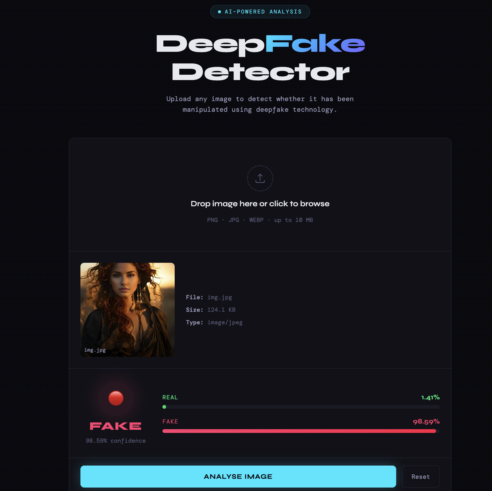

# 🎭 DeepFake Image Detector

A deep learning web application that detects whether an image has been manipulated using deepfake technology. Built with **Xception (TensorFlow/Keras)** for the model and **Flask** for the backend, with a clean frontend.

---

## 📸 Demo

> Upload any image → Get instant Real/Fake verdict with confidence score



---

## 🚀 Features

- ✅ Detects face swaps and deepfake manipulations
- ✅ Drag & drop or click to upload images
- ✅ Real-time confidence score with animated probability bars
- ✅ Recent analysis history panel
- ✅ Works on mobile via local network (same WiFi)
- ✅ Auto-opens browser on startup

---

## 🧠 Model Architecture

- **Base Model:** Xception (pretrained on ImageNet)
- **Input Size:** 299 × 299 × 3
- **Output:** Single sigmoid neuron (Class_0 = Real, Class_1 = Fake)
- **Training:** Random hyperparameter search over dense units and learning rate
- **Best Params:** dense_units=64, learning_rate=0.001
- **Validation Accuracy:** 88.62%
- **Optimizer:** Adam with binary cross-entropy loss

```
Xception (frozen base)
    ↓
GlobalAveragePooling2D
    ↓
Dense(64, relu)
    ↓
Dense(1, sigmoid)
```

---

## 📁 Project Structure

```

Deepfake Media Detection/
│
├── app.py                          ← Flask backend (API + serving)
├── README.md                       ← Project documentation
│
├── Frontend/
│   └── index.html                  ← Frontend (HTML/CSS/JS)
│
├── model/
│   ├── train.py                    ← Script to train the model
│   ├── test.py                     ← Script to test/evaluate model
│   ├── deepfake_detection.keras    ← Saved trained model
│   │
│   └── Data/
│       ├── train/
│       │   ├── Class_0/            ← Real images
│       │   └── Class_1/            ← Fake images
│       │
│       └── test/                  
│           └── Sample Images       ← (Real/Fake)  
└── assets/
    └── demo.png                    ← Screenshot for README

```

---

## ⚙️ Installation & Setup

### Prerequisites

- Python 3.12+
- pip
- Git

### 1. Clone the Repository

```bash
git clone https://github.com/yourusername/deepfake-detector.git
cd deepfake-detector
```

### 2. Create Virtual Environment

```bash
python3 -m venv .venv
source .venv/bin/activate        # Mac/Linux
.venv\Scripts\activate           # Windows
```

### 3. Train Model

```bash
model/train.py
```

### 4. Add Your Trained Model

Place your trained model file in the `model/` folder:

```bash
mkdir -p model
cp /path/to/deepfake_detection.keras model/
```

### 5. Run the App

```bash
python app.py
```

Browser opens automatically at **http://localhost:5000** 🎉

---

## 📱 Access on Mobile

Make sure your phone and computer are on the **same WiFi**, then open:

```
http://192.168.x.x:5000
```

Use the IP shown in your terminal. Always use **http://** not https://.


## 🔧 Configuration

| Variable | Default | Description |
|---|---|---|
| `MODEL_PATH` | `model/deepfake_detection.keras` | Path to your `.keras` model |
| `IMG_SIZE` | `299` | Input image size |
| `THRESHOLD` | `0.50` | Fake detection threshold (0–1) |

```bash
THRESHOLD=0.50 python app.py
```

---

## 🌐 API Reference

### `POST /api/detect`

**Request (multipart/form-data):**

| Field | Type | Description |
|---|---|---|
| `image` | File | Image file to analyse |

**Response:**

```json
{
  "label": "FAKE",
  "confidence": 87.43,
  "fake_prob": 87.43,
  "real_prob": 12.57,
  "demo_mode": false
}
```

### `GET /api/health`

```json
{
  "status": "ok",
  "model_loaded": true,
  "img_size": 299,
  "threshold": 0.5
}
```

---


### Recommended Datasets

| Dataset | Link | Use For |
|---|---|---|
| FaceForensics++ | [GitHub](https://github.com/ondyari/FaceForensics) | Face deepfakes |
| DFDC | [Kaggle](https://www.kaggle.com/c/deepfake-detection-challenge) | Video deepfakes |
| CIFAKE | [Kaggle](https://www.kaggle.com/datasets/birdy654/cifake-real-and-ai-generated-synthetic-images) | AI generated images |

### Train

```bash
python model/deepfake_detection.py
```


## 📦 Requirements

```
flask>=3.0
flask-cors>=4.0
tensorflow>=2.15
Pillow>=10.0
numpy>=1.24
```

---

## 🛠️ Tech Stack

| Layer | Technology |
|---|---|
| Model | TensorFlow / Keras / Xception |
| Backend | Python / Flask |
| Frontend | HTML / CSS / JavaScript |
| Fonts | Syne + DM Mono (Google Fonts) |

---

## ⚠️ Limitations

- Best at detecting **face swap deepfakes**
- May miss some AI-generated images (Midjourney, DALL-E)
- Camera photos may score slightly high
- Not for forensic or legal use without further validation

---

## 🤝 Contributing

1. Fork the repo
2. Create your branch (`git checkout -b feature/AmazingFeature`)
3. Commit (`git commit -m 'Add AmazingFeature'`)
4. Push (`git push origin feature/AmazingFeature`)
5. Open a Pull Request

---

## 📄 License

MIT License — see [LICENSE](LICENSE) for details.

---

## 👨‍💻 Author

**Atharv Mishra**
- GitHub: [@Atharvmishra-prog](https://github.com/Atharvmishra-prog)

---

## 🙏 Acknowledgements

- [Xception Paper](https://arxiv.org/abs/1610.02357) — François Chollet
- [Dataset](https://www.kaggle.com/datasets/manjilkarki/deepfake-and-real-images) -Kaggle
